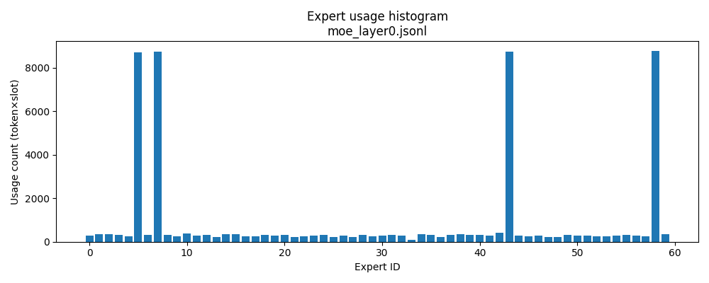

# vLLM MoE Expert Logger (Qwen1.5-MoE-A2.7B-Chat)
Implement an opt-in, flag-gated Mixture-of-Experts (MoE) logger to vLLM. The logger records a single configurable MoE layer, which experts
are selected for each token along with their router weights (e.g. {layer, token_idx, topk_ids, topk_weights}).

## What we build
* New `MoeLogger` class in `vllm/moe_logger.py`.
* Logging is enabled when `VLLM_LOG_MOE` is set; Default behavior unchanged when logging is off.
* In `vllm/vllm/model_executor/layers/fused_moe/layer.py`, inside `FusedMoELayer.select_experts`, the log hooker insert **right after** the router computes `topk_ids` and `topk_weights`, I call:`self.moe_logger.log_routes(...)`, we log per token.

## About
vLLM: A fast and easy-to-use library for LLM inference and serving [Installation](https://blog.vllm.ai/2025/01/10/dev-experience.html) | [Quickstart](https://docs.vllm.ai/en/latest/getting_started/quickstart) | [API](https://docs.vllm.ai/en/stable/api/vllm/model_executor/layers/fused_moe/index.html)

MoE Model: Qwen/Qwen1.5-MoE-A2.7B-Chat (≈14.3B total, 2.7B activated) [Huggin Face](https://huggingface.co/Qwen/Qwen1.5-MoE-A2.7B-Chat)

Prompt Dataset: Use GSM8K test split, first 25 questions [Huggin Face](https://huggingface.co/datasets/openai/gsm8k/tree/main/main)

## Getting Started
OS: Linux/GPU: NVIDIA A100 80GB PCIe

vLLM installation
```bash
git clone https://github.com/vllm-project/vllm.git
cd vllm
export VLLM_USE_PRECOMPILED=1
pip install -e .
```

Data preparation
```bash
python make_prompts.py
```

Baseline run (no logging, compiled kernels)
```bash
unset VLLM_LOG_MOE
python run_generate.py
```
'time.json' is created, recording generation walltime & number of tokens 

Logging run (with MoE routes), specify the logging MoE layer, where all layer (0 - 23) is MoE layer for **Qwen1.5-MoE-A2.7B-Chat**
```bash
export VLLM_MOE_LAYER=12
export VLLM_LOG_MOE=moe_layer12.jsonl
export VLLM_MOE_MODEL_ID="Qwen/Qwen1.5-MoE-A2.7B-Chat"
export VLLM_MOE_SEED=1234

python run_generate.py
```
'moe_routes.jsonl' (default layer 0) / 'moe_layer12.jsonl' (Other layers) record the per-token expert routing decisions for a single MoE layer, where the first line is a meta header that stores run configuration (model ID, vLLM/torch versions, device, seed, MoE layer , and the router’s top-k), every subsequent line is a route record for one generated token at that layer

Plot expert histogram, visualizing where the router sends work inside the MoE layer.
```bash
python plot_expert_hist.py
# e.g. output: expert_hist_layer12.png
```

## Results
Here is the logging result for default MoE layer 0.

Top-3 experts by selection frequency:
  - **Expert 58**: 8792 selections (17.17% of all expert uses)
  - **Expert 7**: 8758 selections (17.10% of all expert uses)
  - **Expert 43**: 8744 selections (17.07% of all expert uses)

Top-3 handles ~51% of all expert usage (60 experts in total), so the router is clearly biased and only subset of experts and parameters are activated during forward pass. In a perfectly balanced MoE layer (Normalized Distribution), each expert would have 1/60 ≈ 1.67% of the traffic, we are far about this.

- **Entropy of expert usage**  
  We measure entropy (in bits) as  
  $H = -\sum_i p_i \log_2 p_i,$
  where \(p_i\) is the normalized usage for expert \(i\).  
  - **Maximum entropy** for 60 equally used experts is \(\log_2(60) \approx 5.91\) bits.  
  - Our measured entropy is **4.10 bits**, which is about **69% of the maximum**.  


